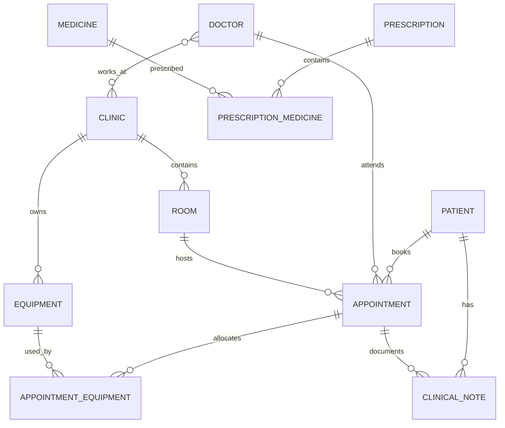

# Relational schema diagram

```mermaid
erDiagram
  CLINIC ||--o{ ROOM : contains
  CLINIC ||--o{ EQUIPMENT : owns
  DOCTOR }o--o{ CLINIC : works_at
  PATIENT ||--o{ APPOINTMENT : books
  DOCTOR ||--o{ APPOINTMENT : attends
  ROOM ||--o{ APPOINTMENT : hosts
  APPOINTMENT ||--o{ APPOINTMENT_EQUIPMENT : allocates
  EQUIPMENT ||--o{ APPOINTMENT_EQUIPMENT : used_by
  PATIENT ||--o{ CLINICAL_NOTE : has
  APPOINTMENT ||--o{ CLINICAL_NOTE : documents
  PRESCRIPTION ||--o{ PRESCRIPTION_MEDICINE : contains
  MEDICINE ||--o{ PRESCRIPTION_MEDICINE : prescribed
```
